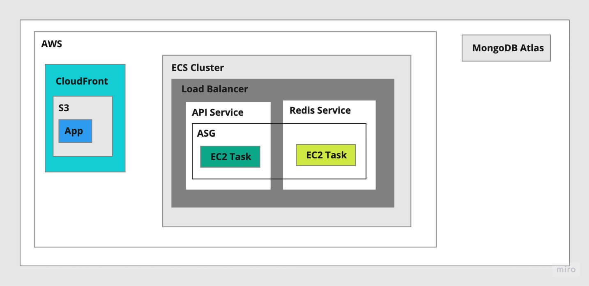

## Game of Three

Game of three is a game where you start with a number and repeatedly divide it by 3, by adding -1 or +1 to it, until you reach 1.

### How to run?

1. Make sure you have the latest version of Docker with Docker Compose installed on your machine.
2. Clone the repository.
3. Run `docker-compose up` in the root directory of the project.
4. Make sure the app and API are running.
5. Open `http://localhost:5173` in your browser.

This will start a development server.

### How does it work?

- A player can create a new game by clicking on the `New Game` on the home page.
- The player can select a game mode from the dropdown.
- If the game mode is not automatic, the player will have to enter their name and 
click the `Join` button.
- If the game mode is automatic/vs computer, the player will join the game automatically.
- The player will have to wait for the other player to join the game.
- The player can share the link to another player or open another browser.
- Once two players have joined the game, the game will start.
- The first player will generate a random number.
- Once the game started, the other player can select an addition in the case of manual mode or the app will select a number autmatically.
- The game state will be updated in real time.
- The game will end when one of the players reaches 1.
- All players have 3 lives and will lose a life if they enter a number not divicible by 3.
- The game will end when one of the players loses all their lives. and the winner will be the other player.

### High-level architecture

#### Notes

- The app will connect to the API using only web-sockets.
- Redis pub/sub will be used to send game updates to the connected players in real time.
- A database (MongoDB) will be used to persist the game state for later use.
- The app should be distributable through a CDN.
- API will only keep connected sockets in memory. the API should be horizontally scalable.

### App notes

- The app is a single page application bulit using React.
- Uses Socket.io to connect to the API.
  - Zustand for state management.
  - React Router for routing.
  - Tailwind CSS for styling.
  - Vite for bundling.
- The `game` folder contains specific components and state for the game which is the main feature of the app.
- The `shared` folder contains shared components for example, `Modal`.

### API notes

- The API is a a Node.JS application.
- Uses Socket.io to create the API.
  - Dotenv for configuration.
  - Vite for bundling.
  - Jest for testing.
  - Mongoose for database connection.
  - Redis for pub/sub.
  - Inversify for dependency injection.
- The `game` module is the main module of the app.
  - `game.controller.ts` is the controller which binds the incoming socket connections with the game service.
  - `game.service.ts` is the service which contains the logic of the game.
  - `game.repository.ts` provides the interface to the database.
  - `game.pubsub.ts` provides the interface to the pub/sub.
- All dependencies are injected using the `inversify` library.
- DB Models are defined in the `models` folder.
- The `helpers` folder contains specific helper classes for example, `MongoDBHelper`.
- All components are decoupled by implementing the interfaces defined in the `index.ts` file of respective modules.

### CI/CD

- The app and the API will be tested and linted for every push using Github Actions.
- The workflow is defined in the `.github/workflows` folder.

### Possible AWS architecture 

### UX Design (Initial design)

[Figma](https://www.figma.com/file/XC8AZwsZi2vPGVHY5PK7NT/Game-of-Three?node-id=0%3A1&t=4PQaKn2vrGkvaAuQ-1)

